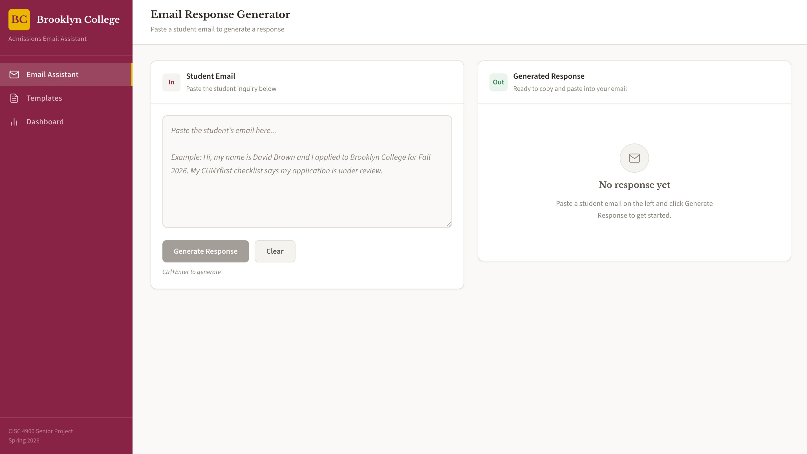
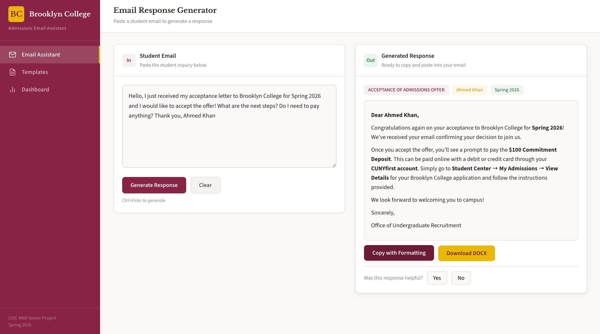
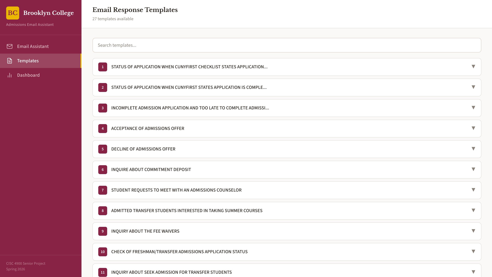
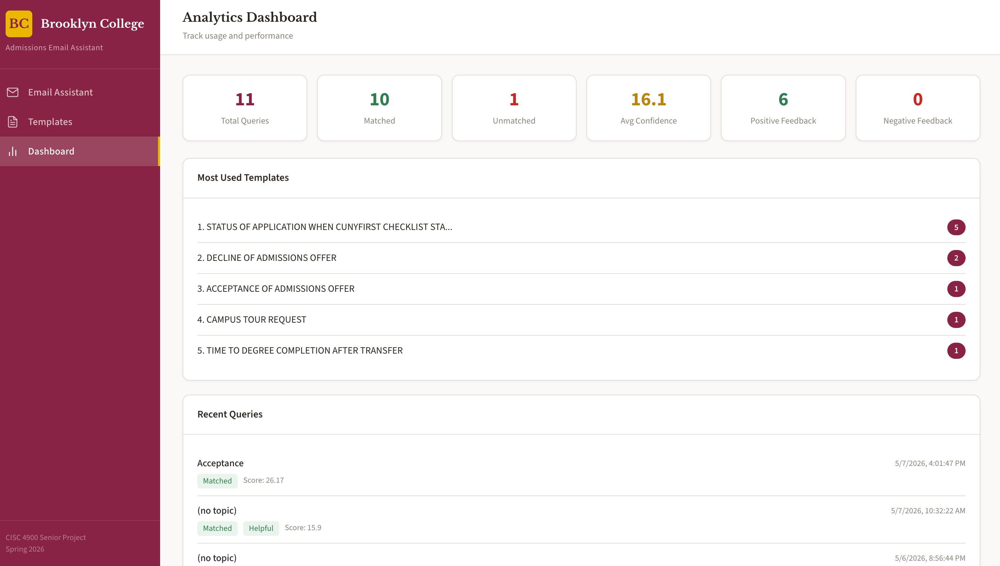
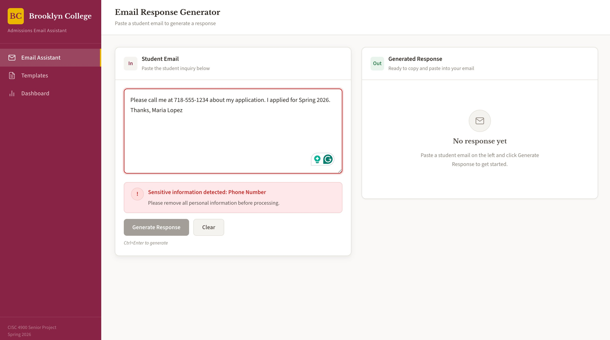
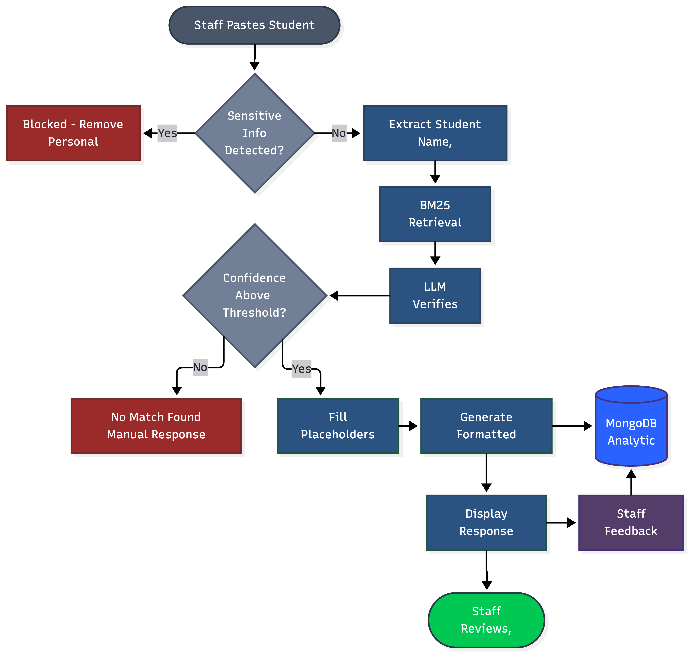

# BC Admissions Email Assistant

An AI-powered email response tool built for the Brooklyn College Office of Undergraduate Admissions. Staff paste a student inquiry, and the system automatically identifies the correct response template, fills in the student's name and semester, and returns a formatted response ready to copy into an email client.

**Live App:** [cisc-4900-final-project.vercel.app](https://cisc-4900-final-project.vercel.app)

---

## Problem

The Brooklyn College admissions office handles over 50 student emails per day. Many of these are repetitive questions about application status, transfer requirements, fee waivers, and campus tours. Staff manually search through a Word document containing 27 response templates, copy the relevant section, and edit it for each student. This process is time-consuming and error-prone during peak periods.

## Solution

This application automates that workflow. Staff paste the student's email, and the system:

1. Checks for sensitive information (SSN, phone numbers, addresses) and blocks processing if found
2. Extracts the student's name, semester, and topic using an LLM
3. Retrieves the best matching template using BM25 keyword search
4. Verifies the match using an LLM as a second check
5. Fills in the student's name and semester while preserving all original formatting
6. Displays the formatted response with bold text, bullet points, and hyperlinks
7. Provides one-click copy (with formatting) and Word document download
8. Logs anonymized usage data to MongoDB for analytics

The system does not generate new content. It only retrieves and personalizes approved templates from the admissions office's own document.

---

## Screenshots

### Home

### Generated Response

### Template Browser

### Analytics Dashboard

### Sensitive Information Detection

---

## System Architecture

---

## Features

- Template matching using BM25 retrieval with title boosting, verified by Llama 3.1 8B
- Student info extraction — automatically detects name and semester from the email
- Placeholder filling at the run level, preserving all Word document formatting including bold, italic, underline, bullet points, and hyperlinks
- Formatted HTML response displayed in the browser, matching the original Word document exactly
- One-click copy with formatting — preserves rich text when pasted into Gmail or Outlook
- Word document download with original formatting intact
- Sensitive information detection — blocks SSN, phone numbers, home addresses, dates of birth, and credit card numbers before they reach the AI
- Confidence threshold — returns "No matching template found" rather than sending a wrong response
- Sidebar navigation with three pages: Email Assistant, Templates, and Dashboard
- Searchable template browser with expandable previews of all 27 templates
- Analytics dashboard tracking total queries, match rates, most used templates, average confidence scores, and staff feedback
- Feedback system with Yes/No buttons on each response, stored in MongoDB
- Edge case handling for missing names, first-name-only signatures, typos, vague emails, and irrelevant questions
- Responsive design with mobile sidebar support
- Brooklyn College branding with official maroon and gold colors

---

## Tech Stack

| Layer | Technology | Purpose |
|-------|-----------|---------|
| Frontend | React 18, Vite 5 | User interface |
| Backend | FastAPI, Python 3.12 | API server |
| Retrieval | BM25 (rank-bm25) | Template matching |
| LLM | Llama 3.1 8B Instruct | Info extraction and template verification |
| LLM API | Hugging Face Inference API | Hosted model access |
| Document Processing | python-docx | Read/write Word documents |
| Database | MongoDB Atlas | Query logging and analytics |
| Frontend Hosting | Vercel | Free tier, auto-deploy |
| Backend Hosting | Render | Free tier, Docker container |
| Dev Environment | GitHub Codespaces | Cloud IDE with auto-configured ports |

---

## Project Structure